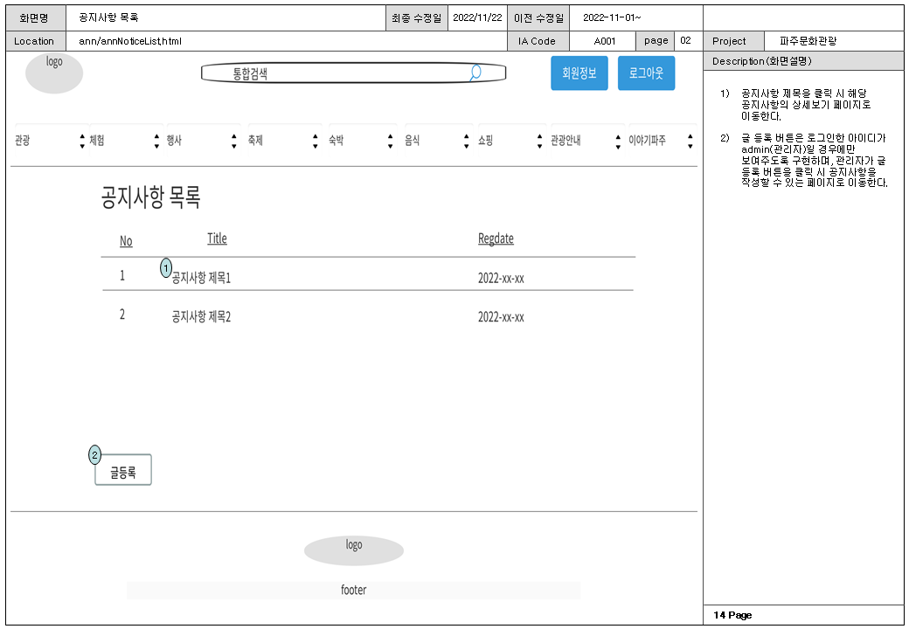
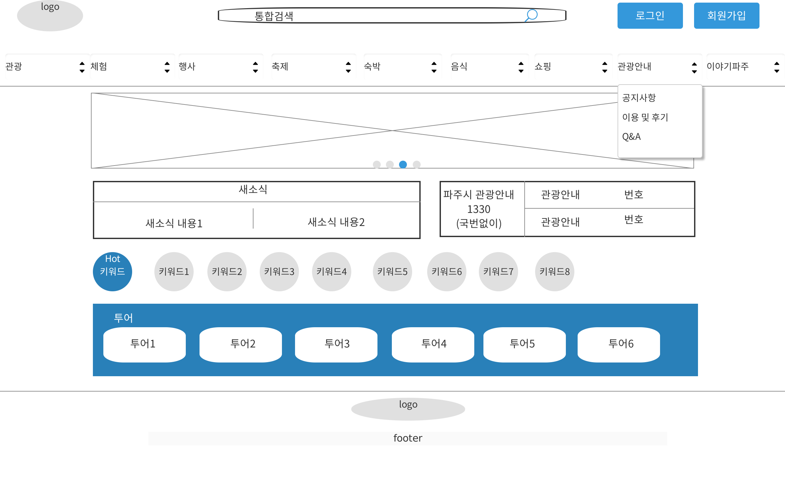

# 파주문화관광 홈페이지

## Front 화면
* https://hyojun-a.github.io/web03/

## 프로젝트 개요 
 "파주문화관광"이라는 실제 홈페이지를 주제로 프론트엔드 부분을 프로토타입, 스토리보드, 메뉴구조도를 활용하여 계획을 하고, HTML, CSS, JAVASCRIPT, JQUERY, Bulma framework를 사용해 구현
, 백엔드 부분은 MVC_Level2의 구조를 사용하여 구현, 데이터베이스는 Maria DB를 활용, 구현된 기능으로는 회원 가입, 회원 목록, 회원 상세보기, 로그인, 로그아웃, 회원 아이디 중복확인,
카테고리별 메뉴, 이미지 저장, 이미지를 사용한 글 등록, 관광명소 목록, 카테고리별 목록, 검색어를 입력하고 원하는 글 찾기, 공지사항 목록, 공지사항 작성, 공지사항 상세보기, 공지사항 수정,
공지사항 삭제, 질문 및 답변 목록, 질문 및 답변 상세보기, 질문 및 답변 글 등록, 질문 및 답변 글 삭제, 이용 및 후기 목록, 이용 및 후기 작성, 이용 및 후기 삭제를 구현 하였음

## 개발 환경
* Eclipse
* Github

## 사용 기술
### Back End
#### MVC_Level2
* Java 8
* AES 256

#### Database
* Maria DB

#### Server
* Tomcat 8

#### Front End
* Bulma framework
* JSTL
* EL

## 주요 키워드
* REST API
* Cache
* HTTP 통신
* MVC모델
* 트랜잭션
* 예외처리
* Git 버전관리

## 백엔드 구현 로직(MVC2)

## 데이터베이스 구조도(ERD)

## 프로젝트 설계
### 메뉴 구조도

### UI프로세스

### 스토리보드

### 프로토타입

## 기능 구현 화면

